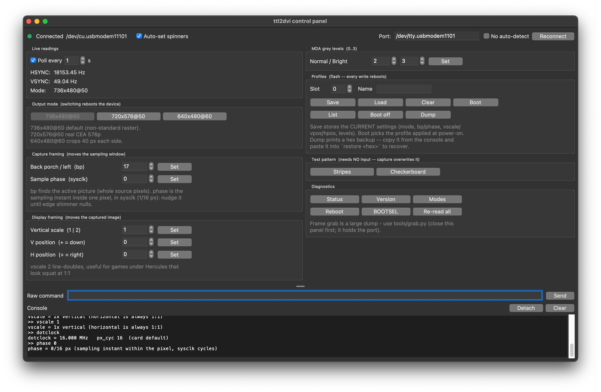

# pico-ttl2dvi

Firmware for the RP2350 that captures **digital TTL video** from retro PC
graphics cards and outputs **DVI/HDMI**, live.

TTL signals go straight into the RP2350, are sampled by PIO, 
reconstructed into a framebuffer, and re-emitted as DVI by 
[PicoDVI](https://github.com/Wren6991/PicoDVI).

## Supported sources

| Source | Data lines | Dot clock | Output |
|---|---|---|---|
| MDA / Hercules (standard) | VIDEO + INTENSITY, 2-bit | 16.257 MHz | 4-level grey |
| MDA / Hercules (16 MHz clone crystal) | VIDEO + INTENSITY, 2-bit | 16.000 MHz | 4-level grey |
| CGA, 640-wide modes | RGBI, 4-bit | 14.333 MHz | 16 colours |
| Commodore 128 VDC, 80-column | RGBI, 4-bit | 16.000 MHz | 16 colours |

Supports text and graphics modes. Colour sources use the standard CGA palette
(including the IBM 5153 "brown" correction).
EGA will be implemented soon.

## Wiring

DE-9 from the card, 330 Ω in series on every line, into the RP2350's 5 V-tolerant
inputs.

| Signal | DE-9 | GPIO |
|---|---|---|
| VIDEO (MDA) | 7 | 20 |
| INTENSITY | 6 | 21 |
| RED | 3 | 22 |
| GREEN | 4 | 23 |
| BLUE | 5 | 24 |
| VSYNC | 9 | 26 |
| HSYNC | 8 | 27 |
| GND | 1 | GND |

DVI output pins are per board (`cmake/boards.cmake` + `src/config/board.h`);
on the default **Waveshare RP2350-PiZero** they are GPIO 32–39.

### Direct (resistors only)

The minimal hookup. The 330 Ω limits current into the RP2350 pad's clamp diode
- that diode *is* the "5 V tolerance", and the resistor is what keeps it safe.

```
   graphics card (TTL, 5V)                     RP2350
   ───────────────────────                     ──────
   DE-9 7   VIDEO      ─────[ 330Ω ]────────►  GPIO 20
   DE-9 6   INTENSITY  ─────[ 330Ω ]────────►  GPIO 21
   DE-9 3   RED        ─────[ 330Ω ]────────►  GPIO 22
   DE-9 4   GREEN      ─────[ 330Ω ]────────►  GPIO 23
   DE-9 5   BLUE       ─────[ 330Ω ]────────►  GPIO 24
   DE-9 9   VSYNC      ─────[ 330Ω ]────────►  GPIO 26
   DE-9 8   HSYNC      ─────[ 330Ω ]────────►  GPIO 27
   DE-9 1,2 GND        ────────────────────►   GND
```

With the pad clamping, each asserted line draws a few mA from the card. Power
the Pico first, then the PC; power the PC down first.

### Buffered (74HCT541 + resistors) - recommended

A 5 V octal buffer between card and Pico. Its CMOS inputs draw ~0 current, so
the video card's drivers are not loaded, and a fault on the Pico side cannot
reach the card. The 330 Ω moves to the buffer's *outputs*, where 5 V logic meets
the 3.3 V pad.

```
                        ┌───────── 74HCT541 ────────┐
                        │ (5V, 100nF across 19-20p) |
   DE-9 7   VIDEO  ────►│ 2  A1              Y1  18 │──[330Ω]──►  GPIO 20
   DE-9 6   INTEN  ────►│ 3  A2              Y2  17 │──[330Ω]──►  GPIO 21
   DE-9 3   RED    ────►│ 4  A3              Y3  16 │──[330Ω]──►  GPIO 22
   DE-9 4   GREEN  ────►│ 5  A4              Y4  15 │──[330Ω]──►  GPIO 23
   DE-9 5   BLUE   ────►│ 6  A5              Y5  14 │──[330Ω]──►  GPIO 24
   DE-9 9   VSYNC  ────►│ 7  A6              Y6  13 │──[330Ω]──►  GPIO 26
   DE-9 8   HSYNC  ────►│ 8  A7              Y7  12 │──[330Ω]──►  GPIO 27
                        │                           │
                 GND ──►│ 1  /OE1          /OE2  19 │◄── GND
                 GND ──►│ 10 GND            Vcc  20 │◄── +5V
                        └───────────────────────────┘

   DE-9 1,2 GND ─────────────── common ground ──────────────►  GND
```

Both `/OE` pins (1 and 19) must go to GND. Tie unused A inputs
to GND, and keep one common ground between card, buffer and Pico.

Use the **HCT** part, not plain HC: its TTL-level input thresholds read a 5 V
TTL high reliably.

## How it works

```
  TTL video ──> [capture] ──> rawbuf ──> [view] ──> framebuffer ──> [video] ──> DVI
                pio0/core0                                        pio1/core1
                     ^                                                ^
                  [sync]                                           [source]
                HSYNC/VSYNC                                     card descriptor
                measurement
```

**No CPU sits in any per-line timing path.** PIO waits on sync edges; 
the CPU only acts once per frame, during vertical blanking. Capture and
DVI are on separate PIOs and separate cores, so neither can stall the other.

Per frame:

1. **`sync`** measures the HSYNC period and pulse width with a PIO countdown.
2. **`capture`** sizes its sampling window from that measurement, then a single
   DMA transfer records one VSYNC-bounded frame of raw samples into `rawbuf`.
   Sampling could be 2× oversampled, so reconstruction can pick the sample nearest
   each pixel's centre rather than its edge.
3. **`view`** reconstructs each line, maps sample values to grey levels or
   palette indices, and composites the result into the framebuffer with the
   current framing (position, vertical scale, letterbox).
4. **`video`** on core 1 walks the framebuffer, TMDS-encodes each scanline and
   feeds the serialiser continuously.

## Modules

| Path | Role |
|---|---|
| `src/config` | Board pins and DVI pin config; the source-card descriptors (pins, dot clock, sysclk, defaults) |
| `src/capture` | PIO sampler + DMA into `rawbuf`; per-line reconstruction. `capture.pio`, `sync_period.pio` |
| `src/video` | Framebuffer, DVI raster tables, TMDS encoding on core 1, colour palette |
| `src/view` | Scan converter: joins capture and video, owns all display framing |
| `src/settings` | Persistent profiles in the last flash sector |
| `src/console` | USB CDC command console |
| `apps/ttl2dvi` | The application: startup order + command table (`main.c`), command bodies (`commands.c`) |
| `apps/dvi_test` | Standalone DVI test card, links libdvi only |
| `extern/dvi` | Vendored PicoDVI (`libdvi`) (fork from [mlorenzati](https://github.com/mlorenzati/PicoDVI)) |
| `tools` | `ttl2dviPanel.py` control panel, `grab.py` frame grabber |


Everything that differs between cards - data pins, dot clock, system clock,
framebuffer depth, TMDS encoder, DVI raster - is selected from the source
descriptor at boot. Switching card reboots into the new configuration.

## Console

Connect to the USB serial port (115200 baud, any terminal) and type `help`.

```
source [n|name]     select the card (reboots)
mode [n]            DVI output raster (reboots)
status              measured HSYNC/VSYNC frequency
bp / phase          capture framing: sampling window, sub-pixel sampling instant
hpos / vpos         display position
vscale [1|2]        vertical line doubling
mdalevels           MDA grey levels
save / load / boot  profile slots in flash (survive power-off)
dump / restore      back up and restore all profiles as hex
capture             dump a frame over USB (see tools/grab.py)
test [0|1]          on-screen test pattern
```

Example:
```
screen /dev/tty.usbmodem1101 115200

ttl2dvi> status
HSYNC 18153.88 Hz   VSYNC 49.04 Hz
ttl2dvi> source
  0  MDA      2 data bits @ GP20, 720 px, 16.257 MHz dot, sysclk 260 MHz   
  1  MDA16    2 data bits @ GP20, 720 px, 16.000 MHz dot, sysclk 256 MHz   <- current
  2  CGA640   4 data bits @ GP21, 640 px, 14.318 MHz dot, sysclk 258 MHz
  3  C128     4 data bits @ GP21, 640 px, 16.000 MHz dot, sysclk 256 MHz
ttl2dvi> dotclock
dotclock = 16.000 MHz   px_cyc 16  (card default)
ttl2dvi> phase 4
phase = 4/16 px (sampling instant within the pixel, sysclk cycles)
ttl2dvi> source 2
switching to CGA640 (reboots; USB will drop)...
```

## ttl2dviPanel

`tools/ttl2dviPanel.py` is a Tk GUI over the same console (needs `pyserial`).

<p align="center">
  
</p>

## Build

Requires the Pico SDK (2.3+) and CMake:

```sh
mkdir build && cd build
cmake -DTTL_BOARD=pizero ..
make -j
```

Or you can use [Docker](ukstep/raspberry-pi-pico-docker-sdk):

```sh
 docker run -d -it --name pico-sdk \
 --mount type=bind,source=${PWD},target=/home/dev \
 lukstep/raspberry-pi-pico-sdk:v1.2.0
 ```


```sh
docker exec -it pico-sdk sh -c \
"cd /home/dev/build && cmake \
-DTTL_BOARD=pizero \
-DPICO_PLATFORM=rp2350-arm-s \
-DPICO_BOARD=pizero .. \
&& make -j\$(nproc)"
```

`TTL_BOARD` selects the hardware profile (`pizero` | `pico2_dvi`) and is the
single source of truth for the board. The output is `build/apps/ttl2dvi/ttl2dvi.uf2`.

## Hardware

Tested on a [Waveshare RP2350-PiZero](https://www.waveshare.com/wiki/RP2350-PiZero) (RP2350B, 48 GPIO, 520 KB SRAM).


## Acknowledgements

Inspired by [mlorenzati/pico-rgb2hdmi](https://github.com/mlorenzati/pico-rgb2hdmi), which
converts analog RGB to HDMI on an RP2040. 

DVI output is [PicoDVI](https://github.com/Wren6991/PicoDVI) by Luke Wren.

## Licence

MIT.

`extern/dvi` is vendored PicoDVI and keeps its own licence - see
`extern/dvi/LICENSE`.
